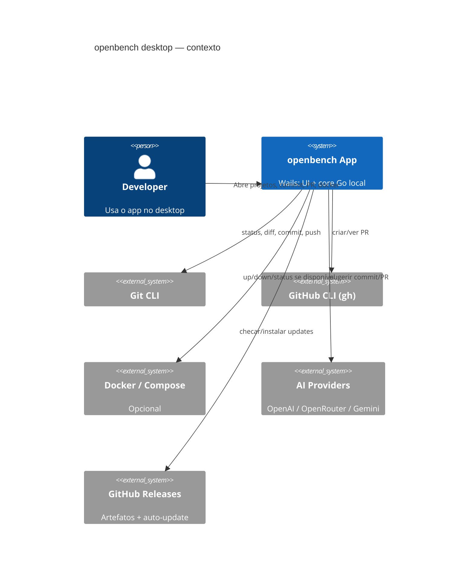
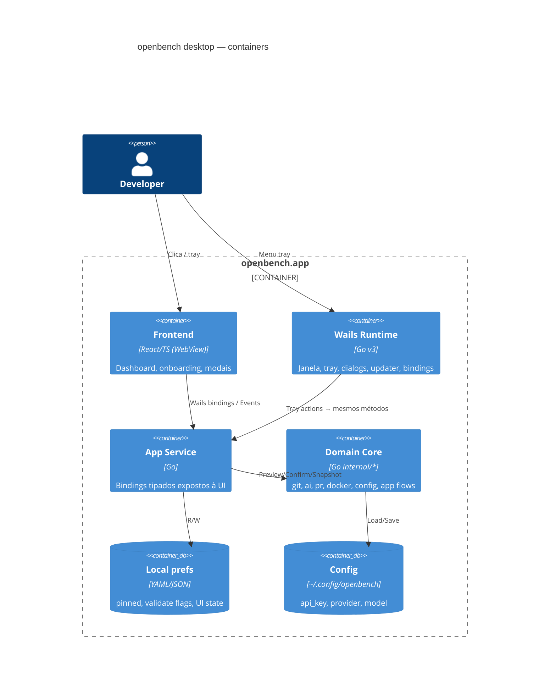
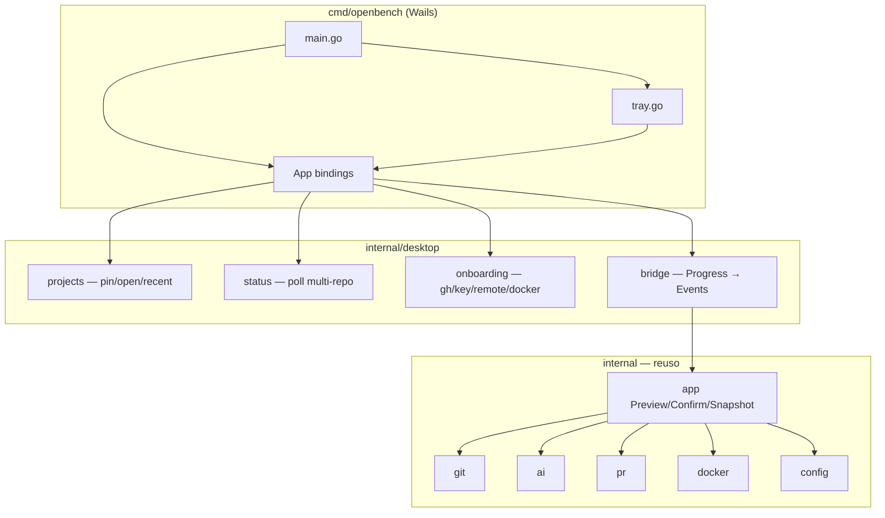

# Arquitetura — App desktop openbench (Wails)

Baseado em [`docs/discovery/resumo-app-desktop-nativo.md`](../discovery/resumo-app-desktop-nativo.md) (confirmado).

## Objetivo

Substituir a CLI/`ob ui` (TUI) por um **aplicativo desktop** multi-OS com:

- janela principal (Open project → dashboard multi-projeto);
- **system tray / menu bar** com atalhos dos comandos mais usados;
- paridade funcional commit / PR / Docker;
- config local reutilizada;
- **auto-update**;
- core Go existente reaproveitado.

## Decisão de stack (resumo)

| Camada | Escolha | ADR |
|--------|---------|-----|
| Desktop shell | **Wails v3** | [ADR-001](adr/001-wails-v3.md) |
| Frontend | **React + Vite + TypeScript** | [ADR-002](adr/002-frontend-react.md) |
| Domínio | Pacotes `internal/{app,git,ai,pr,docker,config,…}` | — |
| Persistência UI | prefs locais (pinned projects, validate commit/PR) | [ADR-003](adr/003-prefs-e-projetos.md) |
| Distribuição | `wails3 package` + updater GitHub | [ADR-004](adr/004-auto-update.md) |
| CLI | Removida na v1 do app | [ADR-005](adr/005-descontinuar-cli.md) |

## C4 — Contexto



## C4 — Containers



## C4 — Componentes (Go)



## Fronteira de reuso do código atual

| Reusar como está (ou quase) | Adaptar | Descontinuar |
|----------------------------|---------|--------------|
| `internal/git`, `docker`, `pr`, `ai`, `formatter` | `internal/app` — garantir APIs que **retornam dados** (não printam); `Progress` → Events Wails | `cmd/ob` (Cobra) |
| `config.Load` / `Save` / paths | Wizard → telas de onboarding React | `internal/tui` (Bubble Tea) |
| `PreviewCommit` / `ConfirmCommit` / equivalentes PR | `RunDocker*` que só imprimem → wrappers tipados | `internal/ui` ANSI one-shot (exceto se útil em logs) |
| `LoadWorkspaceSnapshot` | Multi-projeto: N snapshots + scheduler | `ob ui` entry |

**Regra:** domínio não importa Wails. Só `cmd/openbench` + `internal/desktop` conhecem o runtime.

## Modelo de UI (telas)

1. **Onboarding** — API key, `gh auth`, remote (quando bloqueante).
2. **Open project** — picker nativo + lista de recentes/pinned.
3. **Shell multi-projeto** — abas/pinned; cada uma com dashboard.
4. **Dashboard** — branch, dirty, docker (se detectado), PR aberta, status última geração commit.
5. **Commit modal** — gerar IA → editar → (check validar) → confirmar.
6. **PR modal** — espelha CLI + check validar PR.
7. **Docker panel** — ações equivalentes; oculto se Docker indisponível.
8. **Settings** — config local + checks “validar commit/PR”.

### Tray (v1)

Menu dinâmico (projeto ativo / último focado):

- Abrir openbench  
- Commit…  
- PR…  
- Docker Up / Down *(se disponível)*  
- Separador  
- Projetos pinned (submenu)  
- Quit  

Fechar a janela **não** encerra o app (fica na tray) — `ApplicationShouldTerminateAfterLastWindowClosed: false` (macOS).

## Fluxos técnicos críticos

### Status paralelo multi-projeto

- Um **StatusHub** no Go: por projeto, ticker + `fsnotify` no `.git` (já usado na TUI).
- Emite eventos Wails: `project:status` com payload tipado.
- Limites v1 (premissa de implementação):
  - máx. **8** pinned ativos com poll completo;
  - PR/`gh`: refresh mais lento (ex.: 60s) ou on-demand + após ações;
  - Docker: só projetos com compose detectado e daemon up.

### Commit / PR

```
UI → GenerateCommit(projectID)
   → app.Preview* (AI)
   → UI edita mensagem
   → [se validate] ConfirmDialog
   → ConfirmCommit(projectID, message)
   → Events: commit:done | commit:error
```

Mesmo caminho para ações disparadas pela **tray** (abre modal na janela ou fluxo mínimo com diálogo nativo quando a janela estiver oculta — preferência: **mostrar janela + modal** na v1 para manter review humano).

### Onboarding

`Doctor`-like check na abertura e antes de ações:

| Check | Bloqueia | UI |
|-------|----------|-----|
| config / API key | Commit/PR IA | Onboarding key |
| `gh` instalado + auth | PR | Onboarding gh |
| remote | PR/push | Orientação remote |
| Docker daemon | só esconde Docker | Badge “Docker indisponível” |

### Offline

- Status git/docker locais: ok.
- IA / `gh` rede: erro amigável + retry.

## Estrutura de pastas proposta

```
main.go / tray.go / appservice.go   # entry Wails (raiz — exigência do go:embed)
frontend/                           # React + Vite + TS
build/ + Taskfile.yml               # empacotamento Wails
cmd/ob/                             # CLI (até fase 8 / release desktop)
internal/
  desktop/                          # (próximas fases) orquestração desktop-only
  app/ git/ ai/ pr/ docker/ config/ …
docs/
  architecture/
  discovery/
```

> **Nota fase 0:** o entry ficou na raiz do módulo (não em `cmd/openbench`) porque
> `//go:embed` não permite `../frontend/dist`. O Taskfile/Wails CLI também esperam
> `frontend/` irmão do `main` package.
## Segurança

- API key só em config local / env; UI pode mascarar e gravar via `config.Save`.
- Sem telemetria.
- Updater: verificar assinatura (chave pública embutida) — ver ADR-004.
- Bindings: não expor shell arbitrário; só operações de domínio.

## Observabilidade (v1)

- Logs locais (arquivo em `~/.config/openbench/logs/` ou stdout em dev).
- Sem analytics.

## Plano de implementação (fases)

| Fase | Entrega | Critério de aceite |
|------|---------|-------------------|
| **0** | Skeleton Wails v3 + React; app abre; tray show/hide/quit | ✅ `wails3 build` → `bin/openbench` (2026-07-20) |
| **1** | Open project + 1 dashboard via `LoadWorkspaceSnapshot` | ✅ dialog nativo + dashboard (branch/dirty/docker/PR) |
| **2** | Commit Preview/Confirm + review obrigatório + validate check | ✅ modal + prefs `validate_commit` |
| **3** | PR + onboarding gh/key | ✅ modal PR + Setup (API key / gh / remote) |
| **4** | Docker condicional + ações | ✅ lifecycle + sheet containers/shell/presets (kits) + modal resumo; ver ADR-006 |
| **5** | Multi-projeto pinned + StatusHub | ✅ abas pinned (máx. 8), poll paralelo, tray Projetos |
| **6** | Tray atalhos + prefs persistidas | ✅ Settings modal, tray status/atalhos, aliases pinned |
| **7** | Auto-update (GitHub) + package CI | ✅ Updater + Settings + `docs/release-desktop.md` |
| **8** | Remover CLI/TUI do release; docs/README app-only | ⏸ **adiado** — CLI mantida por enquanto |
| **9** | Windows/Linux smoke | Mesmas features; polish ok-enough |

Ordem deliberada: **macOS vertical slice** antes de multi-projeto pesado e antes de cortar a CLI do repo (corte no **release**, não necessariamente no primeiro PR de scaffold).

## Riscos e mitigações

| Risco | Mitigação |
|-------|-----------|
| Wails v3 em alpha | ADR-001; pin versão; smoke CI mac/win/linux; fallback documentado |
| Polling multi-repo | Limite pinned + refresh escalonado |
| Corte CLI | ADR-005; release notes claros; core testável sem UI |
| Diferenças WebView | Design system simples; evitar APIs browser-only exóticas |
| Assinatura Apple/Windows | Orçamento/tempo de certificados na fase 7 |

## Próximo passo após aprovação desta arquitetura

1. Scaffold `wails3` no repo (fase 0).
2. Extrair/ajustar `internal/app` para contratos “data-first” usados pelos bindings.
3. Implementar fases 1–2 (maior valor de UX).
EOF