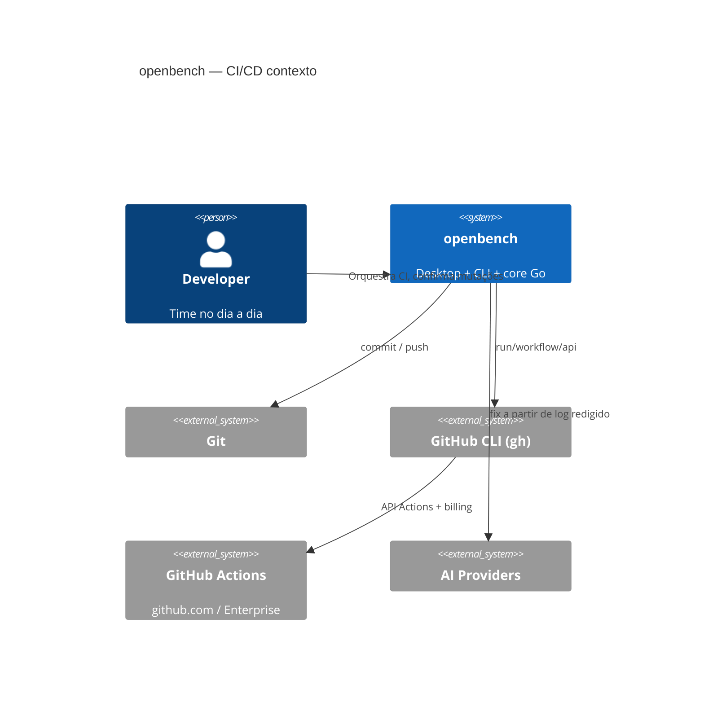
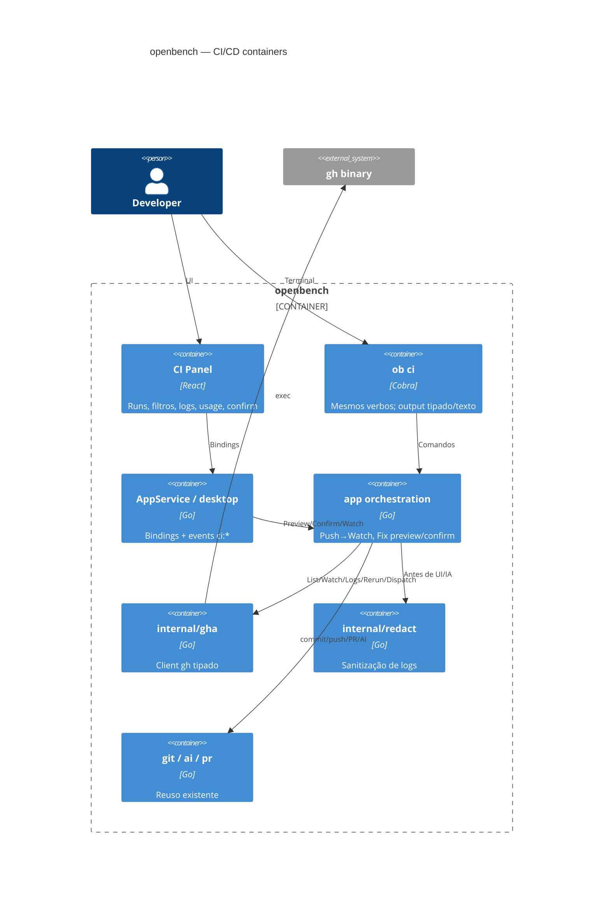
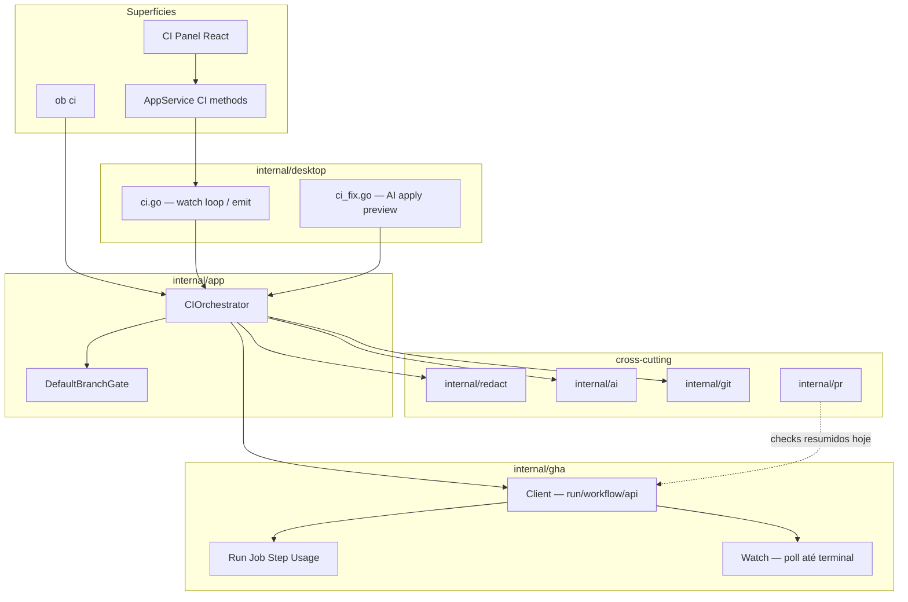

# Arquitetura — Orquestração CI/CD (GitHub Actions)

Baseado em [`docs/discovery/resumo-orquestracao-ci-github-actions.md`](../discovery/resumo-orquestracao-ci-github-actions.md) (confirmado).

ADRs: [007 — transporte via `gh`](adr/007-ci-via-gh-cli.md) · [008 — confirm / sanitize / minutos](adr/008-ci-confirm-sanitize-usage.md)

## Objetivo

Permitir que o time faça o ciclo **commit → push/(PR) → acompanhar Actions → logs → corrigir (IA) ou re-run → confirmar** inteiramente no openbench (desktop + CLI enquanto existir), sem substituir o GitHub Actions.

## Decisões de stack (resumo)

| Camada | Escolha | ADR / nota |
|--------|---------|------------|
| Transporte | `gh run` / `gh workflow` / `gh api` | [ADR-007](adr/007-ci-via-gh-cli.md) |
| Domínio | `internal/gha` + orquestração em `internal/app` | sem Wails |
| Desktop | `internal/desktop` + bindings `AppService` + painel React | eventos Wails |
| CLI | `ob ci …` fino sobre o mesmo domínio | enquanto fase 8 (corte CLI) estiver adiada |
| Mutações | Preview/Confirm + alerta main | [ADR-008](adr/008-ci-confirm-sanitize-usage.md) |
| Logs → IA | redact + failure window | [ADR-008](adr/008-ci-confirm-sanitize-usage.md) |
| Custo | bloco `ActionsUsage` sempre presente | [ADR-008](adr/008-ci-confirm-sanitize-usage.md) |

### Paridade CLI × desktop × ADR-005

- **Domínio único** em Go: fonte da verdade.
- **Desktop** = UX completa (painel, filtros, watch, fix IA).
- **CLI** = mesmos verbos para scripting/dia a dia terminal (`ob ci status|watch|logs|rerun|dispatch|fix`), **enquanto** `cmd/ob` existir (fase 8 do app desktop ainda adiada).
- Se a CLI for cortada no release futuro, o domínio permanece; scripting vira tema separado — não bloqueia esta arquitetura.

## C4 — Contexto



## C4 — Containers



## C4 — Componentes (domínio)



> `internal/pr.Checks*` permanece para badge rápido de PR; o painel CI usa `internal/gha` (runs/jobs/logs/re-run). Evolução futura: badge do dashboard pode agregar `gha.Summary` sem remover checks do PR.

## Modelo de dados (domínio)

```text
RepoRef        { Host, Owner, Name }          // do remote do projeto aberto
Workflow       { ID, Name, Path, State, CanDispatch }
WorkflowRun    { ID, WorkflowID, Name, Event, Status, Conclusion,
                 HeadBranch, HeadSHA, URL, CreatedAt, UpdatedAt,
                 BillableMs? }
Job            { ID, RunID, Name, Status, Conclusion, Steps[] }
Step           { Name, Status, Conclusion, Number }
LogRef         { RunID, JobID?, Attempt }
LogPayload     { RedactedText, Bytes, Truncated bool }
ActionsUsage   { State, RunMinutes?, WindowMinutes?, OrgRemaining?,
                 OrgUsed?, Message }
CIFilter       { FailedOnly, Event?, WorkflowID?, Branch? }
```

Escopo: sempre o **projeto ativo** (path → remote → `RepoRef`).

## Fluxos técnicos

### 1. Happy path pós-push

```
UI/CLI ConfirmPush
  → DefaultBranchGate: se branch == default → warning obrigatório no preview
  → git push
  → gha.WatchAfterPush(branch, headSHA)   // lista runs do SHA; poll ≤~30s
  → emit ci:runs / ci:usage
  → terminal: summary + ActionsUsage
```

### 2. Inspeção de falha + logs sob demanda

```
ListRuns(filter) → Select run/job
  → GetJobs
  → FetchJobLog (sob demanda) → redact → UI
  → ActionsUsage sempre no painel
```

### 3. Re-run (flaky)

```
PreviewRerun(runID|jobID) → mostra custo
  → ConfirmRerun → gha.Rerun → Watch → usage
```

### 4. Fix de código (IA)

```
Fetch failure window → redact
  → AI: propor patch no workspace (máximo mastigado)
  → PreviewFix (diff + commit msg + default-branch warning)
  → ConfirmFix → apply → ConfirmCommit → ConfirmPush → Watch novo run
```

Re-run **não** é o caminho padrão após fix de código.

### 5. workflow_dispatch

```
ListDispatchableWorkflows → PreviewDispatch(inputs)
  → Confirm → gha.Dispatch → Watch
```

### 6. Waiting for approval

Status observado; CTA: texto “aguardando approval no GitHub” (sem approve no app).

## Superfície desktop

| Elemento | Responsabilidade |
|----------|------------------|
| **CI Panel** (dashboard / sheet) | Lista runs, filtros (failed/event/workflow), drill-down jobs/steps, usage sticky |
| **Log viewer** | Carrega sob demanda; texto redigido; botão “Corrigir com IA” |
| **Confirm dialogs** | Re-run, dispatch, fix→push (reusa padrão dos modais commit/PR) |
| **Push preview** | Campo/alerta `DefaultBranchWarning` |
| **Events** | `ci:runs`, `ci:run`, `ci:usage`, `ci:log`, `ci:error` |
| **StatusHub** | Badge agregado no projeto ativo (pass/fail/pending) sem baixar logs |

Onboarding: estender Doctor — `gh` auth + escopos mínimos; se billing falhar, não bloqueia CI, só `ActionsUsage=unavailable`.

## Superfície CLI (enquanto existir)

```text
ob ci status [--failed] [--watch]
ob ci view <run-id>
ob ci logs <run-id> [--job <id>]
ob ci rerun <run-id> [--job <id>] [--yes]
ob ci dispatch <workflow> [--field k=v] [--yes]
ob ci fix <run-id>          # gera preview; confirm explícito
ob ci usage
```

`--yes` só pula prompt interativo quando stdin não for TTY **e** flag explícita — nunca default silencioso em mutações.

## Integração com código atual

| Existente | Papel na CI |
|-----------|-------------|
| `internal/pr` | Mantém checks de PR; não expandir para logs/re-run |
| `internal/app` Preview/Confirm push/commit/PR | Estender com gate de default branch + hook “start CI watch” |
| `internal/desktop/status_hub.go` | Incluir `CISummary` no `ProjectStatus` do ativo |
| `internal/ai` / chat tools | Novo tool/fluxo `ci_fix` consumindo log redigido |
| `internal/desktop/chat.go` | Pode acionar o mesmo FixFlow com confirm na UI |

## Segurança

- Token do `gh`: só no credential helper do SO; openbench não copia para config.
- Logs: ver ADR-008.
- Bindings: sem shell arbitrário; só métodos de domínio (`ListRuns`, `FetchLog`, …).
- Prompts de IA: failure window redigida + paths do workspace; sem env vars.

## Observabilidade

- Erros `gha` classificados: `GhNotInstalled`, `GhAuth`, `Forbidden`, `NotFound`, `Network`, `Parse`.
- Logs locais do app: metadados (run id, status), **nunca** corpo de log de Actions.

## Plano de implementação (fatias verticais)

Meta de produto = conjunto completo de RFs. Entrega interna em fatias **testáveis**, sem cortar RF da meta final:

| Fatia | Entrega | Aceite |
|-------|---------|--------|
| **A — Observe** | `internal/gha` list/view/jobs + painel + `ob ci status/view` + usage best-effort | ✅ `internal/gha` + `ob ci status\|view\|usage` + painel CI (desktop) + `ActionsUsage` |
| **B — Logs** | fetch sob demanda + `redact` + log viewer + `ob ci logs` | ✅ `internal/redact` + `gha.FetchLog` + `ob ci logs` + viewer no painel CI |
| **C — React** | rerun + dispatch + confirms + avisos de minutos | ✅ Preview/Confirm + `ob ci rerun\|dispatch\|workflows` + dialogs no painel |
| **D — Orchestrate** | pós-push watch + default-branch warning no push | Push main alerta; CI aparece sem abrir browser |
| **E — Fix IA** | failure window → patch preview → confirm commit/push → watch | Usuário só confirma; novo run (não re-run) após fix |
| **F — Harden** | GHE smoke, StatusHub badge, Doctor, cache offline do último summary | Enterprise host; offline falha clara; badge no dashboard |

Ordem: A→B→C→D→E→F. “Nascer completo” = A–F mergeados e usáveis; polish visual depois.

## Lacunas da descoberta — resolução arquitetural

| Lacuna | Decisão |
|--------|---------|
| Formato dos minutos | Bloco `ActionsUsage` com estados `run` / `repo_window` / `org` / `unavailable` (ADR-008) |
| Sanitização IA | Redact + só failure window (ADR-008) |
| Approvals | Observar + mensagem; sem approve na v1 |
| Paridade CLI/desktop | Mesmo domínio; CLI verbosa/scriptável; desktop UX completa |
| ADR-005 vs CLI na descoberta | Domínio primeiro; CLI fina enquanto fase 8 adiada |

## Riscos e mitigações

| Risco | Mitigação |
|-------|-----------|
| Escopo completo atrasa adoção | Fatias A–F mergeáveis; cada uma já útil no dia a dia |
| Billing 403 | Estado `unavailable` sempre visível |
| Regex miss em secrets | Limitar janela enviada à IA; documentar limite; denylist futura |
| `gh watch`/`api` frágil | Fixtures + best-effort exit codes; timeouts explícitos |
| GHE divergente | Testes manuais por host; feature detect via erro tipado |
| Push main acidental | Warning obrigatório no preview (não substitui branch protection) |

## Estrutura de pastas proposta

```text
internal/
  gha/           # client + models + watch
  redact/        # sanitização reutilizável
  app/           # CIOrchestrator, gates, fix preview/confirm
  desktop/       # ci.go, events, bridge UI
  pr/            # inalterado na essência (checks PR)
cmd/ob/          # ci.go (comandos) — enquanto CLI existir
frontend/src/components/
  ci-panel.tsx
  ci-log-viewer.tsx
  actions-usage.tsx
appservice_ci.go # bindings Wails
docs/architecture/
  ci-github-actions.md
  adr/007-ci-via-gh-cli.md
  adr/008-ci-confirm-sanitize-usage.md
```

---

**Próximo passo:** fatia **D (Orchestrate)** — pós-push watch + default-branch warning no push.
